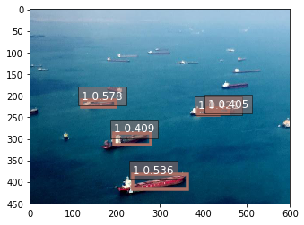

Here is the final output of the project:



## Process

#### Step 1: Create infrastructure

1. Creates SageMaker notebook instance, IAM role, S3 bucket for output
```
aws cloudformation create-stack --stack-name ShipDetection --template-body file://cloudformation/infrastructure.yaml --capabilities CAPABILITY_NAMED_IAM
```
2. Check the status until you receive "CREATE_COMPLETE"
```
aws cloudformation describe-stacks --stack-name ShipDetection --query 'Stacks[0].StackStatus'
```
3. Keep track of the S3 bucket name
```
aws cloudformation describe-stacks --stack-name ShipDetection --query 'Stacks[0].Outputs[0].OutputValue
```

TODO:
* Figure out a clever way to give consumers of this project read access to the S3 bucket in my account so I don't need to toggle public access manually.
* Add this to-be-created repo to the start up of the notebook so all of the files (i.e. train_ship_segmentations_v2.csv) is already there for future users.

#### Step 2: Decide if you want to take a short cut using my prepared data OR rebuild the data yourself.

Short cut: Continue to [Step 3](#step-3-train-deploy-and-test-the-model)

OR

Long way: Continue to [DIY steps](#diy-path)

#### Step 3: Train, deploy, and test the model
Once the CloudFormation code sets up your SageMaker notebook and S3 bucket, you are free to continue. This step leverages my cleaned, transformed, and hosted data.

1. You'll need the name of the S3 bucket you created here for SageMaker output.
2. Open ``notebooks/ship-object-detection.ipynb`` and run through steps.

QUESTION:
* It's weird that this is test data provided by Kaggle, but does not seem to be used. I wonder if this should be combined with the training data and then split out later. Maybe I'm missing something.


## DIY Path

#### Step A: Download data from Kaggle and upload to S3
The long way? Good for you! Remember, you'll only need to follow these steps if you want to start completely from scratch. I am hosting training and validation data in my S3 bucket to simplify the process. That's not your style, though, is it?

_Added time: 6 hours (mostly waiting)_

1. Spin up an EC2 instance or perform the instructions locally
2. Install python3 & pip3
2. Install Kaggle API
3. Provide API credentials locally
4. Download the data
  ```
  kaggle competitions download -c airbus-ship-detection
  ```
5. Unzip training data
  ```
  mkdir training && unzip -qo .zip -d training
  ```
6. Unzip test data
  ```
  mkdir test && unzip -qo .zip -d test
  ```
7. Upload training data
  ```
  aws s3 sync training s3://your-bucket-name/training/
  ```
8. Upload test data
  ```
  aws s3 sync test s3://your-bucket-name/test/
  ```

___Expect to download and transfer about 29 GB.___

| | Total size | Total objects |
| --- | --: | --: |
| Training:| 27.0 GB | 192556 |
| Test: | 2.2 GB | 15606 |

#### Step B: Draw boxes on images
This step shows you how to use a cited notebook to convert masks to bounding boxes.

_Added time: 1-2 hours_

1. Open ``notebooks/from-masks-to-bounding-boxes.ipynb`` and run through steps.

TODO:
* Possibly move ``data/train_ship_segmentations_v2.csv`` from the repo to S3

#### Step C: Create annotation files for training data
This step walks you though modifying data to create annotation files in JSON format.

_Added time: 1-2 hours_

1. Open ``notebooks/data-prep.ipynb`` and run through steps.


## Clean up
1. Tear down the CloudFormation stack
```
aws cloudformation delete-stack --stack-name ShipDetection
```
2. Remove the SageMaker endpoint (this will rack up your bill!)
  1. Make sure you only have the one endpoint
    ```
    aws sagemaker list-endpoints
    ```
  2. Assuming you do, list the endpoints again and pass the first one into a delete command
    ```
    aws sagemaker list-endpoints --query 'Endpoints[0].EndpointName' --output text | xargs -I {} aws sagemaker delete-endpoint --endpoint-name {}
    ```
3. Remove the SageMaker model
  1. Make sure you only have the one model
  ```
  aws sagemaker list-models --query 'Models[0].ModelName' --output text
  ```
  2. Assuming you do, list the models again and pass the first one into a delete command
  ```
  aws sagemaker list-models --query 'Models[0].ModelName' --output text | xargs -I {} aws sagemaker delete-model --model-name {}
  ```
4. Remove the SageMaker endpoint configs
  1. Make sure you only have the one config
  ```
  aws sagemaker list-endpoint-configs --query 'EndpointConfigs[0].EndpointConfigName' --output text
  ```
  2. Assuming you do, list the configs again and pass the first one into a delete command
  ```
  aws sagemaker list-endpoint-configs --query 'EndpointConfigs[0].EndpointConfigName' --output text | xargs -I {} aws sagemaker delete-endpoint-config --endpoint-config-name {}
  ```

## Instructor notes
